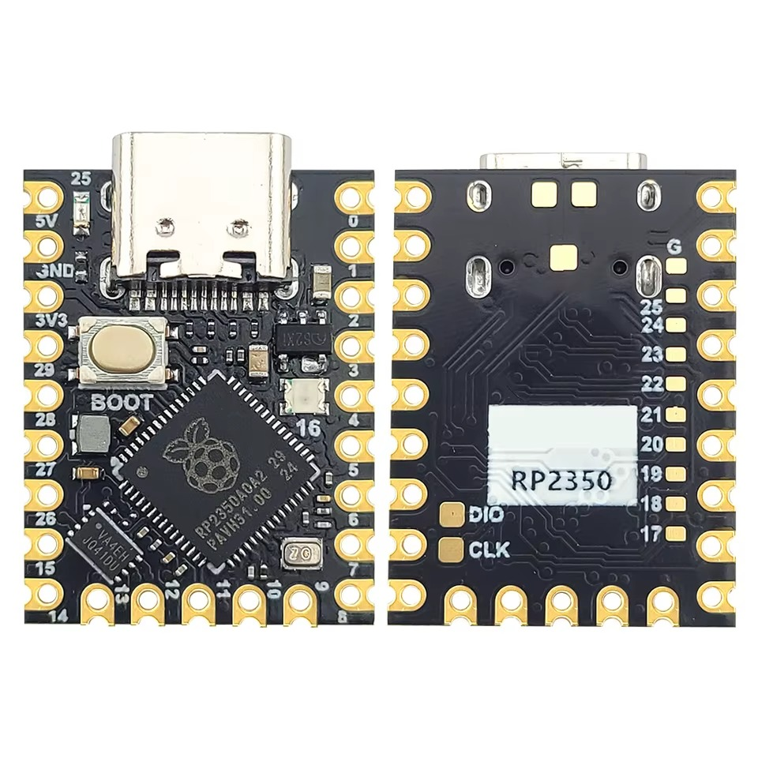

# Wiring — RP2350 Supermini

Pin map for the whole rig, and what is actually connected today.

[desk-move-safe](../desk-move-safe) sits **in** the panel-TX wire — it does not
merely listen — so the two desk channels are wired differently from each other:
two pins in the cut keys wire, one wire tapping the height stream. Six signals
leave this board in total, three to the desk and three to the driver.

## The board

A 23.5 × 18 mm RP2350**A** module — same die as a Pico 2, so `PICO_BOARD pico2`
is correct, but the break-out is not the Pico's:



| Edge | Pads (in order) |
|---|---|
| top-left | `5V` `GND` `3V3` |
| left | GP29 GP28 GP27 GP26 GP15 GP14 |
| bottom | GP13 GP12 GP11 GP10 GP9 GP8 |
| right | GP0 GP1 GP2 GP3 GP4 GP5 GP6 GP7 |
| back, inner row | `G` GP25 GP24 GP23 GP22 GP21 GP20 GP19 GP18 GP17 |

Three consequences that shape everything below:

- **GP16 is not free.** It drives the onboard WS2812 RGB LED. It is also the
  only LED on the board — there is no plain user LED — so it is worth keeping
  for status rather than reclaiming.
- **GP17–GP25 are back-side inner pads**, not castellations: small, close
  together, and awkward to solder to. Treat GP0–GP15 and GP26–GP29 as the
  usable set. That is still 20 pins for the 12 this rig needs.
- **There is exactly one GND pad on the front.** The desk tap, the driver
  logic, the encoder and the motor supply all need to reach it. Do not stack
  four wires on one castellation — run a short pigtail from `GND` to a screw
  terminal or a scrap of stripboard and make that the rig's ground node.

The vendor pinout image (`rp2350/board_pinout_top.png`) has typos — it swaps
SPI1 SCK/TX on GP14/GP15, and the back-side sheet is captioned RP2040. Where it
disagrees with the RP2350 datasheet, the datasheet wins. The assignments below
follow the datasheet.

## Pin map

| GP | Signal | Goes to | Wired |
|---|---|---|---|
| GP0 | UART0 **TX** | → panel RX — only if the height wire is ever cut | **no** |
| GP1 | UART0 **RX** | ← main board TX (`55 AA` height frames) | **yes** |
| GP2, GP3 | — | free | — |
| GP4 | UART1 **TX** | → main board RX — the board hears **only** this | **yes** |
| GP5 | UART1 **RX** | ← panel TX (`AA 55` key frames) | **yes** |
| GP6 | DIR | driver DIR | **yes** |
| GP7 | STEP | driver STEP | **yes** |
| GP8 | EN | driver EN (active low) | **yes** |
| GP9, GP10 | — | the driver's UART, if it is ever turned on (below) | no |
| GP11 | — | the driver's DIAG, or a limit switch | no |
| GP12–GP15 | — | free | — |
| GP16 | — | onboard WS2812, status indicator | — |
| GP26 | SPI1 SCK | MT6835 CLK | not yet |
| GP27 | SPI1 TX | MT6835 MOSI | not yet |
| GP28 | SPI1 RX | MT6835 MISO | not yet |
| GP29 | SPI1 CSn | MT6835 CS | not yet |

**GP0 is not connected**, and the firmware never claims it. The height stream is
tapped, not cut, so the board still drives the panel directly and there is
nothing for us to transmit into. It keeps its place in the map only so that
cutting that wire later needs no rewiring.

The desk side lives in
[desk-move-safe/include/board_config.h](../desk-move-safe/include/board_config.h),
and so does the flap motor; desk-lab (kept locally, not in this repo) is the instrumented rig
that the same map was worked out on.

The flap is one unbroken run. GP7 is the last pad of the right edge and GP8 the
first of the bottom, so **GP6–GP11 are six pads in a row** around the
bottom-right corner: DIR, STEP, EN, then the UART pair if it is ever wanted,
then DIAG. The driver harness is one connector.

**GP26–GP29 are four in a row** at the top of the left edge — the whole encoder
cable, as far from the driver corner as this module gets. CS lands on GP29 on
purpose: GP29 is ADC3 and carries a VSYS sense divider on many RP2350 modules,
and CS is an output, so a weak divider cannot affect it. A MISO there could be
pulled.

Two assignments differ from the earlier WeAct build, and both are forced:

- **The encoder moved GP16–19 → GP26–29.** GP16 is the RGB LED and GP17–19 are
  back-side pads, so the bench rig's SPI0 group is not reachable on this module
  at all. The RP2350's SPI functions repeat every eight pins as RX/CSn/SCK/TX,
  so GP26–GP29 is a complete SPI1 group — and it is the far corner from the
  driver, which is what the sensor cable wants.
- **The driver moved GP2/GP3/GP6 → GP6/GP7/GP8.** Three consecutive pads
  instead of two plus one stranded across the desk bus, and it leaves GP2/GP3
  free beside the desk pins.

## The desk: three wires, two channels, wired differently

The desk's 4-pin panel header is `3.3V RX TX GND`. 9600 8N1, 3.3 V logic
([protocol doc](CL103B-G_protocol.md) §1).

The two channels are not treated alike, and that asymmetry is the whole design:

```
  KEYS    panel ──> board     CUT, routed through us      TWO pins

     panel TX ──1k──> GP5  UART1 RX      we hear every key the panel sends
                              │
                             GP4  UART1 TX ──1k──> board RX
                                                   the board hears only us


  HEIGHT  board ──> panel     UNCUT, tapped in parallel    ONE pin

     board TX ──┬───────────────────────> panel RX     (untouched)
                └──1k──> GP1  UART0 RX                 (just listening)
```

**Cut a wire only to suppress what crosses it. Never to hear it.** A
UART RX pin is a high-impedance input, so any number of listeners can hang off a
line one thing drives — tapping the height stream costs the board nothing and
the panel nothing. The keys wire is cut because suppressing a key press is
exactly what this firmware is for.

| Panel pin | Actually carries | RP2350 | |
|---|---|---|---|
| `RX` | `AA 55` key frames, **panel → board** | GP5 in, GP4 out | **cut** |
| `TX` | `55 AA` height frames, **board → panel** | GP1 in | tapped |
| `GND` | ground | GND | |
| `3.3V` | panel supply | **not connected** | |

> ⚠️ **The panel's `RX`/`TX` labels are swapped.** Photographed on this desk's
> panel PCB: the pin marked `RX` is the one the panel **transmits** on. The
> labels name the main board's role, not the panel's — the board's own header
> is labelled by function and is not swapped.
>
> Getting this backwards puts both leads on the wrong pins at once, and the
> failure is silent in both directions while the desk carries on working
> normally. The same pin serves both roles: the wire you listen to and the wire
> you end up driving are both the one marked `RX`.

Rules, from [protocol doc](CL103B-G_protocol.md) §5:

- **Input pins only.** Never drive a line the panel or the board is already
  driving — two push-pull outputs on one wire corrupt frames and have been
  observed to freeze the panel. GP4 is the one output, and it is legitimate
  only because the panel's end of that wire has actually been cut; the firmware
  leaves it high-impedance until it has *heard* a frame from the panel, which
  is the cheapest available evidence that the cut is real. GP0 is never claimed
  at all.
- **1 k–10 k series resistor in every probe lead.** Invisible at 9600 baud, and
  it is what turns a wiring mistake into nothing happening.
- **Leave the header's 3.3 V pin alone.** It is the panel's supply, not a
  reference. Share ground only.

The board keeps reporting height with the tap in place because the tap changes
nothing electrically — it is one more high-impedance input on a line the board
was already driving.

## The stepper

TMC2209 carrier in the driver's standalone **STEP / DIR / EN** mode.

| Carrier | RP2350 | Note |
|---|---|---|
| VDD | 3V3 | logic supply. Not 5V — RP2350 GPIOs are not 5 V tolerant |
| GND (logic) | the ground node | must be common with the motor supply |
| DIR | GP6 | a level, sampled on the STEP edge |
| STEP | GP7 | rising edge = one microstep |
| EN | GP8 | **active low**: 0 = coils energised |
| MS1, MS2 | strapped | both low = 1/8 (see below) |
| VREF | the trimmer | **the current limit. Set it first.** |
| PDN_UART | leave unconnected | |
| VM, GND | 12–24 V PSU | |
| 1A 1B 2A 2B | motor | one coil per pair — ohm them out first |

GP6–GP8 are three consecutive pads wrapping the bottom-right corner (GP7 ends
the right edge, GP8 begins the bottom), so the driver is one connector. GP9 to
GP11 continue the run for the optional UART pair and DIAG.

### Microstepping is strapping, so the firmware has to be told

MS1/MS2 both low or floating is **1/8** on the TMC2209 — *not* the A4988 table,
and there is no full-step mode.

| MS2 | MS1 | microsteps |
|---|---|---|
| 0 | 0 | 1/8 ← power-on default |
| 0 | 1 | 1/2 |
| 1 | 0 | 1/4 |
| 1 | 1 | 1/16 |

`TMC_MICROSTEPS` in
[board_config.h](../desk-move-safe/include/board_config.h) must match how you
actually strapped it. Nothing detects a mismatch: every "revolutions" figure
the firmware prints, and later every travel limit, is simply off by that ratio,
silently.

### Set VREF before the first run

In this mode VREF **is** the current limit — the firmware cannot see it and
cannot change it. On a 0.11 Ω carrier, `I_rms ≈ 0.71 × VREF`.

Check the sense resistor while you are there: 0.10 Ω, 0.11 Ω and 0.15 Ω all
ship on boards sold under the same description, and it scales everything.

### The four rules that keep drivers alive

Unchanged from the [bench rig](../../test/nema_MT6835/docs/wiring.md):

1. **Never unplug the motor while VM is live.**
2. **≥100 µF electrolytic across VM/GND, physically at the driver.**
3. **Common ground** between the motor supply and the RP2350.
4. **Set VREF before the first run**, and re-calibrate StealthChop after any
   change to it.

If the flap travels the wrong way, invert it in software rather than swapping
motor wires: desk-lab has `FLAP_DIR_EXPAND` for exactly that, and
desk-move-safe gets the equivalent when the flap move itself is wired up.

### The UART option, and why it is off

The driver can also run on a serial link over its PDN_UART pin — built, working,
and switched off. `TMC_UART_ENABLED` in
[board_config.h](../desk-move-safe/include/board_config.h) turns it on, with
`TMC_USE_DIR_PIN` and `TMC_USE_EN_PIN` then free to move DIR and EN into
registers. GP9 and GP10 are reserved for it: TX through a 1 kΩ, RX on the same
node, joined at this board so one wire leaves for the driver.

What it buys: current and microstepping as numbers instead of a trimmer and
jumpers, over-temperature and open-coil reporting, StallGuard, and a wire count
of **two instead of three**.

What it costs, and why one wire did not pay for it here:

- **VM must be live before the chip will answer at all.** Logic power alone is
  silence, permanently, and the symptom is identical to a broken wire.
- **A solder jumper on the carrier ships unbridged.** Watterott
  SilentStepSticks need ["the jumper on the driver … bridged from the middle to
  the respective
  position"](https://learn.watterott.com/silentstepstick/pinconfig/tmc2209/);
  other boards have a pad marked `UART`/`USART` connected to nothing. Until
  that blob exists, correct wiring and correct firmware produce silence.
- **The 1 kΩ is not optional** — both ends drive the one pad.
- **MS1/MS2 become the UART address**, the same pins that used to pick
  microstepping. A driver on the wrong address is silent exactly like a driver
  that is not there.

Three pins that either work or visibly do not, against two pins plus four new
ways to be silently wrong. The firmware keeps both paths compiled, so this is a
one-line decision whenever the trade looks different.

> ⚠️ **desk-lab wants its own harness**, and the two are not
> interchangeable at the driver end:
>
> | | desk-move-safe | desk-lab |
> |---|---|---|
> | STEP | GP7 | GP2 |
> | DIR | GP6 | GP3 |
> | EN | GP8 | GP6 |
> | limit switch | GP11 | GP7 (`PIN_LIMIT`) |
> | MT6835 | GP26–29 | GP8–11 (reserved, unused) |
>
> Both run the driver standalone, so only the pin numbers differ — but they
> differ on every single one. Decide which board the flap harness belongs to
> before soldering it.

## Power

Bench work is **USB only**. You need the USB-CDC console anyway, and
the motor PSU stays a separate supply with its ground tied to the rig's ground
node.

For a permanent install, buck the 24 V down to 5 V and feed the `5V` pad. Then:
**one supply at a time.** There is no ORing diode between the `5V` pad and
VBUS on this module, so 5 V on that pad with USB also plugged in back-feeds the
host port. Unplug one before connecting the other, or put a Schottky in the
buck's output.

The desk header's 3.3 V is not a candidate for powering the rig — it is sized
for a panel with an LCD and a few buttons, and a stepper driver's logic plus an
encoder on top of it is asking for a brown-out that takes the desk down too.

## Two RP2350 traps

**Erratum E9 — do not use internal pull-downs.** A GPIO configured as an input
with the internal pull-down enabled can latch at roughly 2.1 V after being
driven high, instead of returning to 0. Every input on this rig is therefore
pulled *up* and active-low: the limit switch, if you fit one, goes between the
pin and GND and reads LOW when pressed. If you ever genuinely need a
pull-down, make it an external resistor of 8.2 kΩ or less.

**GPIOs are not 5 V tolerant.** The desk bus is 3.3 V and so is the MT6835, so
nothing here violates that — but it is the reason the driver's VDD goes to 3V3
and not 5V, since its outputs swing to whatever you feed it.

## Later phases, wired ahead

Nothing below is needed to bring the rig up; it is here so the pin map does not
have to move again.

**In the wire** *(implemented, and described above)*. The RP2350 sits in the
broken panel-TX wire, between the panel and the board. The section below is why
the channels were grouped onto the UARTs the way they were.

### One UART per channel

The bus is two independent one-way channels, and each gets a whole UART —
receiving one end of its channel and transmitting the other, which is the
shape a UART already has:

```
  HEIGHT channel   board ──> panel     UART0    in GP1   out GP0
  KEY channel      panel ──> board     UART1    in GP5   out GP4
```

```
   main board  TX ──┬──────────────────────> panel RX        (untouched)
                    └──1k──> GP1  UART0 RX                   (just listening)

   panel       TX ──1k──> GP5  UART1 RX  ⟶  GP4 ──1k──> board RX
                                                             (cut, through us)
                          + shared GND
```

Grouping by channel rather than by device is what makes the harness fall out
right: the cut wire's two ends land on **GP4 and GP5, one adjacent pair, one
connector**, and the height tap is a single wire to GP1. GP0 is not needed
until the height channel is cut too.

The alternative — a UART per *device*, each carrying both directions of one
side — needs two UARTs to move one channel and puts the two halves of the cut
wire on opposite pin pairs.

> ⚠️ **Direction within a pair is forced, and this is the one that bites.**
> `GP0` and `GP4` are **TX — outputs, always**. `GP1` and `GP5` are **RX —
> inputs, always**. No setting reverses a pair, so a wire that needs listening
> to has to land on GP1 or GP5, and one that needs driving on GP0 or GP4.
>
> Get a pair backwards and the failure is silent in both directions at once:
> the input you wired to an output pin is fought by our driver and never
> received, and the output you wired to an input pin drives nothing — while
> the panel and board carry on over whatever path is left, so the desk still
> works and you look for the fault everywhere except the pins. `wiring` prints
> the direction of every pin next to what it has actually heard.

`SWAP_UARTS` in desk-lab's `board_config.h`
exchanges the two channels wholesale if the harness would rather have the cut
wire at the top of the right edge.

### What has to be cut

**Cut a wire only to suppress what crosses it. Never to hear it.**

A UART RX pin is a high-impedance input, so any number of listeners can hang
off a line that one thing drives. Tapping costs the driver nothing and the
other listeners nothing.

That settles both wires at once:

| wire | what we need | cut? |
|---|---|---|
| panel TX → board RX | to be able to **stop** the panel's commands | **yes** |
| board TX → panel RX | only to **read** the height | no — tap it |

So exactly one wire is cut, and its two ends land separately: the panel's on
GP5 and the board's on GP0. The height line stays whole, with GP1 hanging off
it through a 1 k resistor alongside the panel — which is why the panel's
display keeps working no matter what this firmware does.

The `board TX → panel RX` direction is a choice, `PROXY_HEIGHT_TO_PANEL`:

| | wires | panel's display |
|---|---|---|
| `0` | 3 signal | fed straight from the board; works whatever the firmware does |
| `1` | 4 signal | fed by us, forwarded byte for byte |

**`0` is the default**, and the right starting point: the panel's display then
works regardless of what the firmware does, which takes a whole class of
failure out of the picture while the rest is being proven. GP4 stays high-Z
and unused. Move to `1` only once there is a reason to shape what the panel
is told, and only after cutting that wire — claiming GP4 while the board is
still driving the panel's RX line is two outputs on one wire. Forwarding is **raw**, not re-encoded from a decoded
height: the field carries flag bits that are only partly understood and the
board may send types this firmware does not decode, so passing the bytes means
a gap in our decoding cannot become a gap in the panel's display.

Keep a 1 kΩ series resistor in every lead, transmit legs included.

### Two safety properties that come from being in the path

**It fails safe.** A desk that is told nothing stops moving. If the firmware
hangs, resets or is unplugged, no key frames reach the board — so the failure
mode of a cut wire is a stationary desk, not a runaway one.

⚠️ **The corollary: a board that is not proxying is a desk that cannot move at
all.** So `PROXY_ON_BOOT` is `1` — the firmware boots straight into
pass-through and the panel drives the desk as it always did. Leave it that
way; with it off, a reset or a reflash locks you out of your own furniture
until you can find a terminal.

Proxying is transport, not control. Taking the desk away from the panel is a
separate switch (`take`, or the intercept firing), and neither is on by
default.

**The ceiling is a guarantee, not a threshold.** `DESK_CEILING_MM` is enforced
in the relay, so an UP command that would carry the desk past it is replaced
with idle — whatever the panel asks, including a button held down, and
whatever any other part of this firmware gets wrong. Enforced `DESK_COAST_MM`
early so the coast lands *at* the limit rather than past it.

### The uncut fallback

`DESK_WIRING_CUT 0` restores the earlier arrangement: panel unplugged, GP5
doing double duty as UART1 RX while sniffing and a PIO transmitter
(desk-lab's `src/uart_tx.pio`) while emulating — GP5's only
hardware UART function is RX, so a transmitter there has to be PIO. No relay
is possible in that mode; there is no break in the wire to relay through.

**Phase 3 — the encoder.** MT6835 breakout, bottom (SPI) header only; the top
header (A/B/Z, U/V/W, PWM) and HVPP stay empty.

| MT6835 | RP2350 | |
|---|---|---|
| VCC | 3V3 | |
| GND | the ground node | |
| CLK | GP26 | SPI1 SCK |
| MOSI | GP27 | SPI1 TX |
| MISO | GP28 | SPI1 RX |
| CS | GP29 | SPI1 CSn, driven by hand |

1 MHz bus. The magnet must be **diametrically** magnetised, 0.5–3 mm above the
package and centred on the shaft axis — that mounting, and how to check it, is
the long half of the [bench rig's wiring
doc](../../test/nema_MT6835/docs/wiring.md).

**Both UARTs are spoken for**, so the TMC2209's own link is a PIO UART — written
and working, switched off, on GP9/GP10. See "The UART option, and why it is off"
above; none of it affects motion either way.
